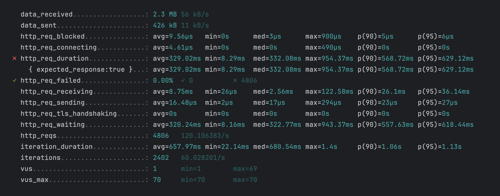

## What is k6?

Grafana k6 is an open-source load testing tool that makes performance testing easy and productive for engineering teams.
k6 is free, developer-centric, and extensible.

Using k6, you can test the reliability and performance of your systems and catch performance regressions and problems earlier.
k6 will help you to build resilient and performant applications that scale.

Run k6 with the following command:

```shell
k6 run blog-load-test-k6.js
```

#### Sample output


